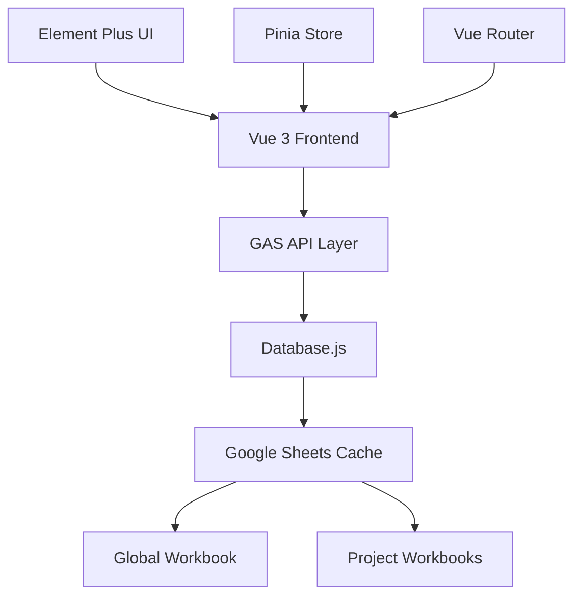

# Google Sheets 分片架構設計

## 架構概述

系統採用 Google Sheets 作為資料庫，考量到 Google Sheets 沒有 SQL WHERE 查詢能力，我們設計了基於「整個分片讀取」的架構策略，將資料按使用場景分離到不同的活頁簿中。這種設計完全免費且提供卓越的資料透明度，同時透過智能快取和批次操作實現高效的資料存取效能。

## 分片策略原則

### 核心設計理念
1. **全域活頁簿**: 存放跨專案共享的全域資料
2. **專案活頁簿**: 每個專案獨立的活頁簿，包含該專案的所有業務資料
3. **整表讀取**: 由於無法進行 WHERE 查詢，採用整個工作表讀取後在記憶體中篩選
4. **資料隔離**: 避免跨專案資料混合，提升安全性和效能
5. **前端整合**: Vue 3 前端透過 GAS API 無縫存取 Google Sheets 資料
6. **智能快取**: 多層快取機制最大化減少 Google Sheets API 調用次數

## 活頁簿架構

### 全域活頁簿 (Global Workbook)
**試算表名稱**: `ScoringSystem-Global`
- **用途**: 存放系統全域資料，所有專案共享
- **特性**: 讀多寫少，資料相對穩定
- **工作表**:
  - `Projects` - 所有專案的基本資訊列表
  - `Users` - 系統用戶總表
  - `SystemConfigs` - 系統設定參數

### 專案活頁簿 (Project Workbook)
**命名規則**: `ScoringSystem-Project-{ProjectID}`
- **用途**: 存放單一專案的完整業務資料
- **特性**: 專案隔離，包含該專案的所有資料
- **工作表**:
  - `ProjectInfo` - 專案詳細資訊
  - `Groups` - 專案群組資料
  - `UserGroups` - 用戶群組關聯
  - `Stages` - 專案階段資料
  - `Submissions` - 成果提交記錄
  - `Rankings` - 排名結果
  - `Comments` - 評論資料
  - `Votes` - 投票記錄
  - `Wallets` - 個人錢包/積分帳本
  - `Transactions` - 交易記錄
  - `EventLogs` - 操作日誌
  - `StageConfigs` - 階段配置參數

## 資料表結構設計

### 全域活頁簿工作表

#### Projects 工作表
| A | B | C | D | E | F | G | H | I | J |
|---|---|---|---|---|---|---|---|---|---|
| projectId | projectName | description | totalStages | currentStage | status | createdBy | createdTime | lastModified | workbookId |
| proj_uuid1 | 測試專案 | 描述 | 5 | 1 | active | pm@email.com | 1640000000000 | 1640000000000 | sheet_id_123 |

#### Users 工作表  
| A | B | C | D | E | F | G |
|---|---|---|---|---|---|---|
| userId | userEmail | displayName | registrationTime | lastLoginTime | status | preferences |
| usr_uuid1 | user@email.com | 使用者 | 1640000000000 | 1640000000000 | active | {} |

#### SystemConfigs 工作表
| A | B | C | D | E | F |
|---|---|---|---|---|---|
| configKey | configValue | description | category | lastModified | createdBy |
| default_stage_duration | 7 | 預設階段持續天數 | timing | 1640000000000 | system |
| default_rank1_reward | 100 | 預設第一名獎勵 | scoring | 1640000000000 | system |
| default_rank2_reward | 60 | 預設第二名獎勵 | scoring | 1640000000000 | system |

### 專案活頁簿工作表

#### ProjectInfo 工作表
| A | B | C | D | E | F | G | H | I |
|---|---|---|---|---|---|---|---|---|
| projectId | projectName | description | totalStages | currentStage | status | createdBy | createdTime | lastModified |
| proj_uuid1 | 測試專案 | 專案詳細描述 | 5 | 1 | active | pm@email.com | 1640000000000 | 1640000000000 |

#### Groups 工作表
| A | B | C | D | E | F | G |
|---|---|---|---|---|---|---|
| groupId | groupName | description | createdBy | createdTime | status | allowChange |
| grp_uuid1 | A組 | 描述 | pm@email.com | 1640000000000 | active | TRUE |

#### UserGroups 工作表
| A | B | C | D | E | F |
|---|---|---|---|---|---|
| membershipId | groupId | userEmail | role | joinTime | isActive |
| mbr_uuid1 | grp_uuid1 | user@email.com | member | 1640000000000 | TRUE |

#### Wallets 工作表
| A | B | C | D | E | F | G |
|---|---|---|---|---|---|---|
| walletId | userEmail | currentBalance | totalEarned | totalSpent | lastUpdated | metadata |
| wlt_uuid1 | user@email.com | 150 | 200 | 50 | 1640000000000 | {} |

#### Stages 工作表
| A | B | C | D | E | F | G | H | I |
|---|---|---|---|---|---|---|---|---|
| stageId | stageName | stageOrder | startDate | endDate | consensusDeadline | status | description | createdTime |
| stg_uuid1 | 階段1 | 1 | 1640000000000 | 1641000000000 | 1640500000000 | active | 描述 | 1640000000000 |

#### Submissions 工作表
| A | B | C | D | E | F | G | H | I | J |
|---|---|---|---|---|---|---|---|---|---|
| submissionId | stageId | groupId | contentMarkdown | actualAuthors | participationProposal | version | submitTime | submitterEmail | status |
| sub_uuid1 | stg_uuid1 | grp_uuid1 | # 內容 | ["user@email.com"] | {"user": 1.0} | v1 | 1640000000000 | user@email.com | submitted |

#### RankingProposals 工作表
| A | B | C | D | E | F | G |
|---|---|---|---|---|---|---|
| proposalId | stageId | groupId | proposerEmail | rankingData | status | createdTime |
| prop_uuid1 | stg_uuid1 | grp_uuid1 | user@email.com | {"grp_A":1,"grp_B":2} | pending | 1640000000000 |

#### ProposalVotes 工作表
| A | B | C | D | E | F | G |
|---|---|---|---|---|---|---|
| voteId | proposalId | voterEmail | groupId | agree | timestamp | comment |
| vote_uuid1 | prop_uuid1 | user1@email.com | grp_uuid1 | TRUE | 1640000000000 | 同意此排名 |

#### FinalRankings 工作表
| A | B | C | D | E | F | G |
|---|---|---|---|---|---|---|
| rankingId | stageId | groupId | rankingData | submittedTime | submissionType | metadata |
| frnk_uuid1 | stg_uuid1 | grp_uuid1 | {"grp_A":1,"grp_B":2} | 1640000000000 | consensus | {} |

#### SystemRankings 工作表
| A | B | C | D | E | F | G | H | I | J |
|---|---|---|---|---|---|---|---|---|---|
| rankingId | stageId | groupId | finalRank | studentRank | pmRank | studentWeight | pmWeight | totalScore | calculatedTime |
| srnk_uuid1 | stg_uuid1 | grp_uuid1 | 1 | 1.5 | 1 | 0.7 | 0.3 | 1.35 | 1640000000000 |

#### Comments 工作表
| A | B | C | D | E | F | G | H | I | J | K |
|---|---|---|---|---|---|---|---|---|---|---|
| commentId | stageId | authorEmail | content | mentionedGroups | parentCommentId | isReply | replyLevel | isAwarded | awardRank | createdTime |
| cmt_uuid1 | stg_uuid1 | user@email.com | 我認為@grp_A的報告很棒 | ["grp_A"] | NULL | FALSE | 0 | FALSE | NULL | 1640000000000 |

#### CommentRankingProposals 工作表
| A | B | C | D | E | F |
|---|---|---|---|---|---|
| proposalId | stageId | authorEmail | rankingData | createdTime | metadata |
| crnk_uuid1 | stg_uuid1 | user@email.com | {"cmt_A":1,"cmt_B":2,"cmt_C":3} | 1640000000000 | {} |

#### CommentNotifications 工作表
| A | B | C | D | E | F | G | H |
|---|---|---|---|---|---|---|---|
| notificationId | stageId | commentId | mentionedGroupId | notified | notifiedTime | createdTime | metadata |
| noti_uuid1 | stg_uuid1 | cmt_uuid1 | grp_uuid1 | TRUE | 1640000000000 | 1640000000000 | {} |

#### Votes 工作表
| A | B | C | D | E | F | G | H | I |
|---|---|---|---|---|---|---|---|---|
| voteId | voterGroupId | voterEmail | stageId | voteType | targetId | voteValue | timestamp | metadata |
| vote_uuid1 | pm_group | pm@email.com | stg_uuid1 | pm_ranking | grp_uuid2 | 1 | 1640000000000 | {} |

#### Transactions 工作表
| A | B | C | D | E | F | G | H | I | J |
|---|---|---|---|---|---|---|---|---|---|
| transactionId | userEmail | stageId | transactionType | amount | source | timestamp | relatedSubmissionId | relatedCommentId | metadata |
| txn_uuid1 | user@email.com | stg_uuid1 | rank_reward_1st | 100 | 第一名獎勵 | 1640000000000 | sub_uuid1 | NULL | {} |

#### EventLogs 工作表  
| A | B | C | D | E | F | G | H | I |
|---|---|---|---|---|---|---|---|---|
| logId | userEmail | action | resourceType | resourceId | details | timestamp | ipAddress | userAgent |
| log_uuid1 | user@email.com | submission_created | submission | sub_uuid1 | {} | 1640000000000 | IP位址 | User Agent |

#### StageConfigs 工作表
| A | B | C | D | E | F | G | H | I | J | K | L |
|---|---|---|---|---|---|---|---|---|---|---|---|
| configId | stageId | rank1Reward | rank2Reward | rank3Reward | comment1stReward | comment2ndReward | comment3rdReward | approvalThreshold | maxResubmissions | evaluationThreshold | pmWeight | criteria |
| cfg_uuid1 | stg_uuid1 | 100 | 60 | 30 | 20 | 15 | 10 | 0.67 | 3 | 0.5 | 0.3 | {} |

## 工作表結構定義

### 代碼中的結構範本

**設計原則**：所有工作表結構定義都寫在代碼中，不存儲在數據庫中。這樣確保：
- **版本控制**：結構變更有清楚的版本歷史
- **部署一致性**：所有環境使用相同的結構定義
- **維護簡便**：不需要額外的範本管理UI
- **唯讀新增設計**：結構定義屬於系統核心，不需要運行時修改

```javascript
// scripts/database_templates.js - 工作表結構定義

/**
 * 全域活頁簿工作表結構
 */
const GLOBAL_WORKBOOK_TEMPLATES = {
  Projects: [
    'projectId', 'projectName', 'description', 'totalStages', 
    'currentStage', 'status', 'createdBy', 'createdTime', 
    'lastModified', 'workbookId'
  ],
  
  Users: [
    'userId', 'userEmail', 'displayName', 'registrationTime', 
    'lastLoginTime', 'status', 'preferences'
  ],
  
  SystemConfigs: [
    'configKey', 'configValue', 'description', 'category', 
    'lastModified', 'createdBy'
  ]
};

/**
 * 專案活頁簿工作表結構
 */
const PROJECT_WORKBOOK_TEMPLATES = {
  ProjectInfo: [
    'projectId', 'projectName', 'description', 'totalStages', 
    'currentStage', 'status', 'createdBy', 'createdTime', 'lastModified'
  ],
  
  Groups: [
    'groupId', 'groupName', 'description', 'createdBy', 
    'createdTime', 'status', 'allowChange'
  ],
  
  UserGroups: [
    'membershipId', 'groupId', 'userEmail', 'role', 'joinTime', 'isActive'
  ],
  
  Stages: [
    'stageId', 'stageName', 'description', 'startDate', 'endDate', 
    'status', 'consensusDeadline'
  ],
  
  Submissions: [
    'submissionId', 'stageId', 'groupId', 'contentMarkdown', 
    'actualAuthors', 'submissionTime', 'lastModified'
  ],
  
  Rankings: [
    'rankingId', 'stageId', 'groupId', 'rankings', 'submittedBy', 'submissionTime'
  ],
  
  Comments: [
    'commentId', 'stageId', 'authorEmail', 'content', 'mentionedGroups', 
    'parentCommentId', 'isReply', 'replyLevel', 'createdTime'
  ],
  
  Votes: [
    'voteId', 'stageId', 'voterEmail', 'voteType', 'voteData', 'voteTime'
  ],
  
  Wallets: [
    'walletId', 'userEmail', 'currentBalance', 'totalEarned', 
    'totalSpent', 'lastUpdated', 'metadata'
  ],
  
  Transactions: [
    'transactionId', 'userEmail', 'amount', 'transactionType', 
    'description', 'relatedEntityId', 'timestamp'
  ],
  
  EventLogs: [
    'logId', 'userEmail', 'action', 'entityType', 'entityId', 
    'details', 'timestamp', 'ipAddress'
  ]
};

/**
 * 創建工作表並設定標題行
 */
function createSheetWithHeaders(spreadsheet, sheetName, headers) {
  const sheet = spreadsheet.insertSheet(sheetName);
  
  // 設定標題行
  const headerRange = sheet.getRange(1, 1, 1, headers.length);
  headerRange.setValues([headers]);
  
  // 設定標題行格式
  headerRange.setFontWeight('bold');
  headerRange.setBackground('#f0f0f0');
  headerRange.setHorizontalAlignment('center');
  
  return sheet;
}

/**
 * 獲取工作表結構定義
 */
function getGlobalWorkbookTemplate() {
  return GLOBAL_WORKBOOK_TEMPLATES;
}

function getProjectWorkbookTemplate() {
  return PROJECT_WORKBOOK_TEMPLATES;
}
```

## 活頁簿管理策略

### 自動創建專案活頁簿
```javascript
function createProjectWorkbook(projectId, projectName) {
  // 創建專案活頁簿
  const workbookName = `ScoringSystem-Project-${projectId}`;
  const spreadsheet = SpreadsheetApp.create(workbookName);
  const workbookId = spreadsheet.getId();
  
  // 設置工作表結構
  setupProjectWorkbookStructure(spreadsheet);
  
  // 在全域活頁簿中記錄專案資訊
  recordProjectInGlobal(projectId, projectName, workbookId);
  
  return { workbookId, spreadsheet };
}

function setupProjectWorkbookStructure(spreadsheet) {
  // 獲取專案活頁簿結構模板
  const templates = getProjectWorkbookTemplate();
  
  // 刪除預設工作表
  const defaultSheet = spreadsheet.getActiveSheet();
  
  // 根據模板創建所有工作表
  Object.keys(templates).forEach(sheetName => {
    const headers = templates[sheetName];
    createSheetWithHeaders(spreadsheet, sheetName, headers);
  });
  
  // 刪除預設工作表
  spreadsheet.deleteSheet(defaultSheet);
}

function setupGlobalWorkbookStructure(spreadsheet) {
  // 獲取全域活頁簿結構模板
  const templates = getGlobalWorkbookTemplate();
  
  // 刪除預設工作表
  const defaultSheet = spreadsheet.getActiveSheet();
  
  // 根據模板創建所有工作表
  Object.keys(templates).forEach(sheetName => {
    const headers = templates[sheetName];
    createSheetWithHeaders(spreadsheet, sheetName, headers);
  });
  
  // 刪除預設工作表
  spreadsheet.deleteSheet(defaultSheet);
}
```

### 活頁簿路由策略
```javascript
function getWorkbook(projectId) {
  // 從全域活頁簿獲取專案的活頁簿ID
  const globalData = readGlobalData();
  const projectInfo = globalData.projects.find(p => p.projectId === projectId);
  
  if (!projectInfo) {
    throw new Error(`專案不存在: ${projectId}`);
  }
  
  return SpreadsheetApp.openById(projectInfo.workbookId);
}

function getGlobalWorkbook() {
  const globalWorkbookId = PropertiesService.getScriptProperties().getProperty('GLOBAL_WORKBOOK_ID');
  return SpreadsheetApp.openById(globalWorkbookId);
}

/**
 * 新增：智能分片管理 - 自動在 DATABASE_FOLDER 中建立分片
 */
function getProjectWorkbookSmart(projectId, autoCreate = true) {
  try {
    // 先從全域活頁簿查找
    const globalData = readGlobalData();
    const projectInfo = globalData.projects.find(p => p.projectId === projectId);
    
    if (projectInfo && projectInfo.workbookId) {
      try {
        return SpreadsheetApp.openById(projectInfo.workbookId);
      } catch (error) {
        console.warn(`專案活頁簿遺失: ${projectInfo.workbookId}`);
      }
    }
    
    // 自動建立新的專案活頁簿
    if (autoCreate) {
      console.log(`為專案 ${projectId} 自動建立分片`);
      const projectName = projectInfo?.projectName || `Project-${projectId}`;
      return createProjectDatabase(projectId, projectName);
    }
    
    throw new Error(`專案活頁簿不存在: ${projectId}`);
    
  } catch (error) {
    console.error('獲取專案活頁簿失敗:', error);
    throw error;
  }
}

/**
 * 系統初始化函數 - 設定完整資料庫
 */
function setupDatabaseSystem() {
  console.log('初始化資料庫系統...');
  
  // 檢查 DATABASE_FOLDER
  const databaseFolder = ConfigManager.getSystemConfig('DATABASE_FOLDER');
  if (!databaseFolder) {
    throw new Error('請先設定 DATABASE_FOLDER:\nPropertiesService.getScriptProperties().setProperty("DATABASE_FOLDER", "folder_id")');
  }
  
  // 初始化全域資料庫
  const globalWorkbook = initializeDatabase();
  
  // 初始化系統配置
  ConfigManager.initializeSystem();
  
  console.log('資料庫系統初始化完成');
  return globalWorkbook;
}
```

## 查詢策略：整表讀取模式

### 全域資料查詢
```javascript
function readGlobalData() {
  const globalWorkbook = getGlobalWorkbook();
  
  return {
    projects: readFullSheet(globalWorkbook, 'Projects'),
    users: readFullSheet(globalWorkbook, 'Users'),
    systemConfigs: readFullSheet(globalWorkbook, 'SystemConfigs')
  };
}

function readFullSheet(workbook, sheetName) {
  const sheet = workbook.getSheetByName(sheetName);
  const data = sheet.getDataRange().getValues();
  const headers = data[0];
  
  return data.slice(1).map(row => {
    const obj = {};
    headers.forEach((header, index) => {
      obj[header] = row[index];
    });
    return obj;
  });
}
```

### 專案資料查詢
```javascript
function readProjectData(projectId) {
  const projectWorkbook = getWorkbook(projectId);
  
  return {
    projectInfo: readFullSheet(projectWorkbook, 'ProjectInfo')[0], // 只有一筆
    groups: readFullSheet(projectWorkbook, 'Groups'),
    userGroups: readFullSheet(projectWorkbook, 'UserGroups'),
    stages: readFullSheet(projectWorkbook, 'Stages'),
    submissions: readFullSheet(projectWorkbook, 'Submissions'),
    rankings: readFullSheet(projectWorkbook, 'Rankings'),
    comments: readFullSheet(projectWorkbook, 'Comments'),
    votes: readFullSheet(projectWorkbook, 'Votes'),
    wallets: readFullSheet(projectWorkbook, 'Wallets'),
    transactions: readFullSheet(projectWorkbook, 'Transactions'),
    eventLogs: readFullSheet(projectWorkbook, 'EventLogs'),
    stageConfigs: readFullSheet(projectWorkbook, 'StageConfigs')
  };
}
```

### 記憶體篩選策略
```javascript
function filterDataInMemory(data, filters) {
  return data.filter(item => {
    return Object.keys(filters).every(key => {
      const filterValue = filters[key];
      const itemValue = item[key];
      
      if (Array.isArray(filterValue)) {
        return filterValue.includes(itemValue);
      }
      
      return itemValue === filterValue;
    });
  });
}

// 使用範例
function getUserWallet(projectId, userEmail) {
  const projectData = readProjectData(projectId);
  const wallets = filterDataInMemory(projectData.wallets, { 
    userEmail: userEmail 
  });
  
  return wallets[0] || null;
}

function getStageSubmissions(projectId, stageId) {
  const projectData = readProjectData(projectId);
  return filterDataInMemory(projectData.submissions, { 
    stageId: stageId 
  });
}
```

### 快取機制
```javascript
const workbookCache = new Map();
const dataCache = new Map();
const CACHE_TIMEOUT = 5 * 60 * 1000; // 5分鐘

function getCachedProjectData(projectId) {
  const cacheKey = `project_${projectId}`;
  
  if (dataCache.has(cacheKey)) {
    const cached = dataCache.get(cacheKey);
    if (Date.now() - cached.timestamp < CACHE_TIMEOUT) {
      return cached.data;
    }
  }
  
  const data = readProjectData(projectId);
  dataCache.set(cacheKey, {
    data: data,
    timestamp: Date.now()
  });
  
  return data;
}

function invalidateCache(projectId) {
  const cacheKey = `project_${projectId}`;
  dataCache.delete(cacheKey);
}
```

## 性能優化策略

### 批次操作限制
- **讀取**: 每個工作表一次性讀取所有資料（避免多次 API 調用）
- **寫入**: 批次寫入，每次最多 1,000 行資料
- **快取**: 專案資料快取 5 分鐘，減少重複讀取

### 資料分離原則
- **全域 vs 專案**: 全域資料變動少，專案資料變動頻繁
- **讀寫分離**: 讀取整表資料，寫入針對特定行
- **記憶體處理**: 在 GAS 記憶體中進行篩選和處理

### 容量管理
- **活頁簿監控**: 定期檢查專案活頁簿大小
- **資料封存**: 完成的專案可封存到獨立檔案
- **清理策略**: 定期清理舊的 EventLogs 和 Transactions

## 容錯與一致性

### 活頁簿故障處理
```javascript
function handleWorkbookFailure(projectId, error) {
  console.error(`專案活頁簿故障: ${projectId}`, error);
  
  try {
    // 嘗試重新獲取活頁簿
    const workbook = getWorkbook(projectId);
    return { success: true, recovered: true };
  } catch (retryError) {
    // 記錄故障
    logWorkbookError(projectId, error);
    return { success: false, needsManualIntervention: true };
  }
}
```

### 資料一致性檢查
```javascript
function validateProjectConsistency(projectId) {
  const issues = [];
  const globalData = readGlobalData();
  const projectData = readProjectData(projectId);
  
  // 檢查專案基本資訊一致性
  const globalProject = globalData.projects.find(p => p.projectId === projectId);
  const projectInfo = projectData.projectInfo;
  
  if (globalProject.totalStages !== projectData.stages.length) {
    issues.push({
      type: 'stage_count_mismatch',
      expected: globalProject.totalStages,
      actual: projectData.stages.length
    });
  }
  
  // 檢查錢包餘額一致性
  projectData.wallets.forEach(wallet => {
    const totalTransactions = projectData.transactions
      .filter(t => t.userEmail === wallet.userEmail)
      .reduce((sum, t) => sum + parseFloat(t.amount), 0);
    
    if (Math.abs(wallet.totalEarned - totalTransactions) > 0.01) {
      issues.push({
        type: 'wallet_balance_mismatch',
        userEmail: wallet.userEmail,
        walletTotal: wallet.totalEarned,
        transactionTotal: totalTransactions
      });
    }
  });
  
  return issues;
}
```

## 寫入策略

### 新增資料
```javascript
function addRowToSheet(projectId, sheetName, data) {
  const workbook = getWorkbook(projectId);
  const sheet = workbook.getSheetByName(sheetName);
  
  // 準備新行資料
  const headers = sheet.getRange(1, 1, 1, sheet.getLastColumn()).getValues()[0];
  const newRow = headers.map(header => data[header] || '');
  
  // 新增到工作表
  sheet.appendRow(newRow);
  
  // 使快取失效
  invalidateCache(projectId);
}
```

### 更新資料
```javascript
function updateSheetRow(projectId, sheetName, idField, idValue, updates) {
  const workbook = getWorkbook(projectId);
  const sheet = workbook.getSheetByName(sheetName);
  const data = sheet.getDataRange().getValues();
  const headers = data[0];
  
  // 找到要更新的行
  const idColIndex = headers.indexOf(idField);
  const rowIndex = data.findIndex((row, index) => 
    index > 0 && row[idColIndex] === idValue
  );
  
  if (rowIndex === -1) {
    throw new Error(`找不到 ${idField}: ${idValue}`);
  }
  
  // 更新資料
  Object.keys(updates).forEach(field => {
    const colIndex = headers.indexOf(field);
    if (colIndex !== -1) {
      sheet.getRange(rowIndex + 1, colIndex + 1).setValue(updates[field]);
    }
  });
  
  // 使快取失效
  invalidateCache(projectId);
}
```

## 遷移與部署

### 初始化系統
```javascript
function initializeSystem() {
  // 創建全域活頁簿
  const globalWorkbook = SpreadsheetApp.create('ScoringSystem-Global');
  const globalWorkbookId = globalWorkbook.getId();
  
  // 設置工作表結構
  setupGlobalWorkbookStructure(globalWorkbook);
  
  // 存儲全域活頁簿 ID
  PropertiesService.getScriptProperties().setProperty('GLOBAL_WORKBOOK_ID', globalWorkbookId);
  
  return globalWorkbookId;
}

function setupGlobalWorkbookStructure(workbook) {
  // 使用代碼中定義的結構模板
  const templates = getGlobalWorkbookTemplate();
  const defaultSheet = workbook.getActiveSheet();
  
  // 根據模板創建工作表
  Object.keys(templates).forEach(sheetName => {
    const headers = templates[sheetName];
    createSheetWithHeaders(workbook, sheetName, headers);
  });
  
  workbook.deleteSheet(defaultSheet);
}
```

### 資料備份策略
```javascript
function backupProjectData(projectId) {
  const projectData = readProjectData(projectId);
  const backupName = `Backup-${projectId}-${new Date().toISOString().slice(0, 10)}`;
  
  // 創建備份活頁簿
  const backupWorkbook = SpreadsheetApp.create(backupName);
  
  // 複製所有資料
  Object.keys(projectData).forEach(sheetName => {
    if (Array.isArray(projectData[sheetName])) {
      const sheet = backupWorkbook.insertSheet(sheetName);
      writeDataToSheet(sheet, projectData[sheetName]);
    }
  });
  
  return backupWorkbook.getId();
}
```

## Vue 3 前端整合架構

### 前端資料流設計



### GAS API Composables

```javascript
// composables/useProjectData.js
import { ref, computed, onMounted } from 'vue'
import { useGASApi } from './useGASApi'

export function useProjectData(projectId) {
  const { callGAS, loading, error } = useGASApi()
  
  // 響應式資料
  const projectData = ref(null)
  const stages = ref([])
  const submissions = ref([])
  const userGroups = ref([])
  
  // 計算屬性
  const currentStage = computed(() => {
    if (!stages.value.length) return null
    return stages.value.find(stage => stage.status === 'active')
  })
  
  const userPermissions = computed(() => {
    const userEmail = sessionStorage.getItem('userEmail')
    const groups = userGroups.value.filter(ug => ug.userEmail === userEmail)
    return groups.flatMap(group => group.permissions || [])
  })
  
  // 載入專案資料
  const loadProjectData = async () => {
    try {
      const data = await callGAS('getCompleteProjectData', projectId)
      
      // 更新響應式資料
      projectData.value = data.project
      stages.value = data.stages
      submissions.value = data.submissions
      userGroups.value = data.userGroups
      
      // 快取到 localStorage
      localStorage.setItem(`project_${projectId}`, JSON.stringify(data))
      
      return data
    } catch (err) {
      console.error('載入專案資料失敗:', err)
      throw err
    }
  }
  
  // 重新整理特定資料
  const refreshStages = async () => {
    const data = await callGAS('getProjectStages', projectId)
    stages.value = data
  }
  
  const refreshSubmissions = async () => {
    const data = await callGAS('getProjectSubmissions', projectId)
    submissions.value = data
  }
  
  // 提交成果
  const submitDeliverable = async (stageId, content, authors) => {
    const result = await callGAS('submitDeliverable', {
      projectId,
      stageId,
      content,
      authors
    })
    
    // 更新本地資料
    await refreshSubmissions()
    return result
  }
  
  // 投票排名
  const submitRanking = async (stageId, rankings) => {
    const result = await callGAS('submitGroupRanking', {
      projectId,
      stageId,
      rankings
    })
    
    return result
  }
  
  // 自動載入
  onMounted(() => {
    // 嘗試從快取載入
    const cached = localStorage.getItem(`project_${projectId}`)
    if (cached) {
      const data = JSON.parse(cached)
      projectData.value = data.project
      stages.value = data.stages
      submissions.value = data.submissions
      userGroups.value = data.userGroups
    }
    
    // 載入最新資料
    loadProjectData()
  })
  
  return {
    // 資料
    projectData: computed(() => projectData.value),
    stages: computed(() => stages.value),
    submissions: computed(() => submissions.value),
    userGroups: computed(() => userGroups.value),
    currentStage,
    userPermissions,
    
    // 狀態
    loading,
    error,
    
    // 方法
    loadProjectData,
    refreshStages,
    refreshSubmissions,
    submitDeliverable,
    submitRanking
  }
}
```

### Element Plus 組件整合

```vue
<!-- 根據 layout.png 設計的主要介面布局 -->
<template>
  <el-container class="project-container" direction="vertical">
    <!-- 頂部導航列 - 匹配設計圖的頂部結構 -->
    <el-header class="project-header" height="60px">
      <div class="header-left">
        <el-breadcrumb separator="/" class="header-breadcrumb">
          <el-breadcrumb-item :to="{ name: 'Home' }">
            <i class="fas fa-home"></i> 首頁
          </el-breadcrumb-item>
          <el-breadcrumb-item>
            <i class="fas fa-project-diagram"></i> 
            {{ projectData?.projectName || '載入中...' }}
          </el-breadcrumb-item>
        </el-breadcrumb>
      </div>
      
      <div class="header-right">
        <el-button-group class="header-actions">
          <el-button 
            type="primary" 
            @click="refreshData"
            :loading="loading"
            size="default">
            <i class="fas fa-sync-alt"></i> 重新整理
          </el-button>
          <el-button 
            type="default" 
            @click="openSettingsDrawer"
            size="default">
            <i class="fas fa-cog"></i> 設定
          </el-button>
        </el-button-group>
        
        <!-- 用戶資訊下拉選單 -->
        <el-dropdown class="user-dropdown">
          <el-avatar :size="32" class="user-avatar">
            <i class="fas fa-user"></i>
          </el-avatar>
          <template #dropdown>
            <el-dropdown-menu>
              <el-dropdown-item @click="logout">
                <i class="fas fa-sign-out-alt"></i> 登出
              </el-dropdown-item>
            </el-dropdown-menu>
          </template>
        </el-dropdown>
      </div>
    </el-header>
    
    <!-- 主內容區域 - 根據設計圖採用左右分割布局 -->
    <el-container class="main-container">
      <!-- 左側主內容區 - 對應設計圖左側區域 -->
      <el-main class="main-content">
        <!-- 階段狀態概覽 - 對應設計圖上方區域 -->
        <el-card class="overview-card" shadow="never">
          <template #header>
            <div class="card-header">
              <h3><i class="fas fa-chart-line"></i> 專案狀態概覽</h3>
              <el-tag :type="getProjectStatusType(projectData?.status)" size="large">
                {{ projectData?.status }}
              </el-tag>
            </div>
          </template>
          
          <!-- 進度條和統計 -->
          <div class="project-progress">
            <el-progress 
              :percentage="projectProgress" 
              :color="progressColor"
              :stroke-width="8"
              class="main-progress" />
            <div class="progress-stats">
              <span>第 {{ projectData?.currentStage }} / {{ projectData?.totalStages }} 階段</span>
            </div>
          </div>
        </el-card>
        
        <!-- 階段列表 - 對應設計圖中央區域 -->
        <el-card class="stages-card" shadow="never">
          <template #header>
            <div class="card-header">
              <h3><i class="fas fa-tasks"></i> 階段列表</h3>
              <el-button 
                v-if="canManage" 
                type="primary" 
                size="small"
                @click="addStage">
                <i class="fas fa-plus"></i> 新增階段
              </el-button>
            </div>
          </template>
          
          <el-row :gutter="16" v-loading="loading">
            <!-- 階段卡片 -->
            <el-col 
              v-for="stage in stages" 
              :key="stage.stageId"
              :xs="24" :sm="12" :md="8" :xl="6"
              class="stage-col">
              
              <el-card 
                :class="['stage-card', `stage-${stage.status}`]"
                shadow="hover"
                :body-style="{ padding: '16px' }">
            
            <template #header>
              <div class="stage-header">
                <h3>{{ stage.stageName }}</h3>
                <el-tag 
                  :type="getStageStatusType(stage.status)"
                  size="small">
                  <i :class="getStageStatusIcon(stage.status)"></i>
                  {{ getStageStatusText(stage.status) }}
                </el-tag>
              </div>
            </template>
            
            <div class="stage-content">
              <p class="stage-description">{{ stage.description }}</p>
              
              <div class="stage-timeline">
                <el-timeline :reverse="false">
                  <el-timeline-item 
                    timestamp="開始時間" 
                    :type="stage.status === 'active' ? 'primary' : 'info'">
                    {{ formatDateTime(stage.startDate) }}
                  </el-timeline-item>
                  
                  <el-timeline-item 
                    timestamp="共識截止" 
                    type="warning"
                    v-if="stage.consensusDeadline">
                    {{ formatDateTime(stage.consensusDeadline) }}
                  </el-timeline-item>
                  
                  <el-timeline-item 
                    timestamp="階段結束" 
                    type="danger">
                    {{ formatDateTime(stage.endDate) }}
                  </el-timeline-item>
                </el-timeline>
              </div>
              
              <!-- 提交狀態 -->
              <div class="submission-status" v-if="stage.status === 'active'">
                <el-progress 
                  :percentage="getStageProgress(stage)"
                  :status="getProgressStatus(stage)"
                  :stroke-width="6">
                </el-progress>
                <p class="progress-text">
                  {{ getProgressText(stage) }}
                </p>
              </div>
            </div>
            
            <template #footer>
              <div class="stage-actions">
                <el-button 
                  type="primary" 
                  size="small"
                  @click="openDetailsDrawer(stage)"
                  :icon="ElIconView">
                  查看詳情
                </el-button>
                
                <el-button 
                  v-if="canSubmit(stage)"
                  type="success" 
                  size="small"
                  @click="openSubmitDrawer(stage)"
                  :icon="ElIconUpload">
                  提交成果
                </el-button>
                
                <el-button 
                  v-if="canVote(stage)"
                  type="warning" 
                  size="small"
                  @click="openVotingDrawer(stage)"
                  :icon="ElIconStar">
                  評分排名
                </el-button>
              </div>
            </template>
              
            </el-card>
          </el-col>
        </el-row>
      </el-card>
    </el-main>
    
    <!-- 右側邊欄 - 對應設計圖右側區域 -->
    <el-aside width="320px" class="project-aside">
      <!-- 快速操作面板 -->
      <el-card class="quick-actions-card" shadow="never">
        <template #header>
          <h4><i class="fas fa-bolt"></i> 快速操作</h4>
        </template>
        
        <div class="quick-actions">
          <el-button 
            type="primary" 
            class="action-btn"
            @click="openSubmitDrawer(getCurrentStage())"
            :disabled="!canSubmitCurrent"
            block>
            <i class="fas fa-upload"></i>
            提交成果
          </el-button>
          
          <el-button 
            type="warning" 
            class="action-btn"
            @click="openVotingDrawer(getCurrentStage())"
            :disabled="!canVoteCurrent"
            block>
            <i class="fas fa-star"></i>
            評分排名
          </el-button>
          
          <el-button 
            type="info" 
            class="action-btn"
            @click="openCommentDrawer"
            block>
            <i class="fas fa-comments"></i>
            發表評論
          </el-button>
        </div>
      </el-card>
      
      <!-- 最新動態 -->
      <el-card class="activity-card" shadow="never">
        <template #header>
          <h4><i class="fas fa-bell"></i> 最新動態</h4>
        </template>
        
        <el-timeline class="activity-timeline">
          <el-timeline-item 
            v-for="activity in recentActivities" 
            :key="activity.id"
            :timestamp="formatTime(activity.timestamp)"
            :type="getActivityType(activity.type)"
            size="small">
            <div class="activity-content">
              <strong>{{ activity.actorName }}</strong> 
              {{ getActivityText(activity) }}
            </div>
          </el-timeline-item>
        </el-timeline>
      </el-card>
      
      <!-- 群組成員 -->
      <el-card class="members-card" shadow="never">
        <template #header>
          <h4><i class="fas fa-users"></i> 群組成員</h4>
        </template>
        
        <div class="members-list">
          <div 
            v-for="member in projectMembers" 
            :key="member.userEmail"
            class="member-item">
            <el-avatar :size="28" class="member-avatar">
              {{ member.displayName?.charAt(0) || member.userEmail.charAt(0) }}
            </el-avatar>
            <div class="member-info">
              <div class="member-name">{{ member.displayName }}</div>
              <div class="member-role">{{ member.roleName }}</div>
            </div>
            <el-tag 
              :type="member.isOnline ? 'success' : 'info'" 
              size="small">
              {{ member.isOnline ? '線上' : '離線' }}
            </el-tag>
          </div>
        </div>
      </el-card>
    </el-aside>
  </el-container>
      
      <!-- 系統設計：統一使用 el-drawer 實作所有彈出視窗 -->
      
      <!-- 成果提交抽屜 -->
      <SubmitDrawer 
        v-model="submitDrawerVisible"
        :stage="currentEditStage"
        @submit="handleSubmit" />
      
      <!-- 評分排名抽屜 -->
      <VotingDrawer 
        v-model="votingDrawerVisible"
        :stage="currentEditStage"
        :submissions="getCurrentStageSubmissions"
        @vote="handleVote" />
      
      <!-- 階段詳情抽屜 -->
      <StageDetailsDrawer 
        v-model="detailsDrawerVisible"
        :stage="currentEditStage"
        :submissions="getCurrentStageSubmissions" />
      
      <!-- 專案設定抽屜 -->
      <ProjectSettingsDrawer 
        v-model="settingsDrawerVisible"
        :project="projectData" 
        @update="handleProjectUpdate" />
    </el-main>
  </el-container>
</template>

<script setup>
import { ref, computed } from 'vue'
import { ElMessage, ElMessageBox } from 'element-plus'
import { View as ElIconView, Upload as ElIconUpload, Star as ElIconStar } from '@element-plus/icons-vue'
import { useProjectData } from '@/composables/useProjectData'
import SubmitDrawer from '@/components/SubmitDrawer.vue'
import VotingDrawer from '@/components/VotingDrawer.vue'
import StageDetailsDrawer from '@/components/StageDetailsDrawer.vue'
import ProjectSettingsDrawer from '@/components/ProjectSettingsDrawer.vue'

// Props
const props = defineProps({
  projectId: {
    type: String,
    required: true
  }
})

// Composables
const {
  projectData,
  stages,
  submissions,
  userPermissions,
  loading,
  error,
  loadProjectData,
  submitDeliverable,
  submitRanking
} = useProjectData(props.projectId)

// Drawer 狀態
const submitDrawerVisible = ref(false)
const votingDrawerVisible = ref(false)
const detailsDrawerVisible = ref(false)
const settingsDrawerVisible = ref(false)
const currentEditStage = ref(null)

// 計算屬性
const getCurrentStageSubmissions = computed(() => {
  if (!currentEditStage.value) return []
  return submissions.value.filter(sub => sub.stageId === currentEditStage.value.stageId)
})

// 方法
const getStageStatusType = (status) => {
  const statusMap = {
    'active': 'success',
    'completed': 'info',
    'pending': 'warning',
    'archived': ''
  }
  return statusMap[status] || 'info'
}

const getStageStatusIcon = (status) => {
  const iconMap = {
    'active': 'fas fa-play',
    'completed': 'fas fa-check-circle',
    'pending': 'fas fa-clock',
    'archived': 'fas fa-archive'
  }
  return iconMap[status] || 'fas fa-question-circle'
}

const formatDateTime = (timestamp) => {
  return new Date(timestamp).toLocaleString('zh-TW')
}

const canSubmit = (stage) => {
  return stage.status === 'active' && userPermissions.value.includes('submit')
}

const canVote = (stage) => {
  return userPermissions.value.includes('vote')
}

const refreshData = async () => {
  try {
    await loadProjectData()
    ElMessage.success('資料已更新')
  } catch (err) {
    ElMessage.error('更新失敗')
  }
}

const openSubmitDrawer = (stage) => {
  currentEditStage.value = stage
  submitDrawerVisible.value = true
}

const openVotingDrawer = (stage) => {
  currentEditStage.value = stage
  votingDrawerVisible.value = true
}

const openDetailsDrawer = (stage) => {
  currentEditStage.value = stage
  detailsDrawerVisible.value = true
}

const openSettingsDrawer = () => {
  settingsDrawerVisible.value = true
}

const handleSubmit = async (data) => {
  try {
    await submitDeliverable(data.stageId, data.content, data.authors)
    ElMessage.success('提交成功!')
    submitDrawerVisible.value = false
  } catch (err) {
    ElMessage.error(`提交失敗: ${err.message}`)
  }
}

const handleVote = async (data) => {
  try {
    await submitRanking(data.stageId, data.rankings)
    ElMessage.success('評分提交成功!')
    votingDrawerVisible.value = false
  } catch (err) {
    ElMessage.error(`評分失敗: ${err.message}`)
  }
}

const handleProjectUpdate = async (data) => {
  try {
    await loadProjectData() // 重新載入專案資料
    ElMessage.success('專案設定已更新')
    settingsDrawerVisible.value = false
  } catch (err) {
    ElMessage.error(`更新失敗: ${err.message}`)
  }
}
</script>

<style scoped>
.project-container {
  min-height: 100vh;
  background: #f0f2f5;
}

.project-header {
  display: flex;
  justify-content: space-between;
  align-items: center;
  padding: 0 24px;
  background: white;
  border-bottom: 1px solid #e4e7ed;
  box-shadow: 0 1px 4px rgba(0,21,41,.08);
}

.header-left {
  display: flex;
  align-items: center;
}

.header-right {
  display: flex;
  align-items: center;
  gap: 16px;
}

.user-dropdown {
  cursor: pointer;
}

.user-avatar {
  background: var(--el-color-primary);
}

.main-container {
  background: transparent;
}

.main-content {
  padding: 24px;
  background: transparent;
}

.project-aside {
  background: white;
  border-left: 1px solid #e4e7ed;
  padding: 24px 16px;
}

/* 卡片樣式 - 匹配設計圖 */
.overview-card, .stages-card {
  margin-bottom: 24px;
  border-radius: 8px;
  border: 1px solid #e4e7ed;
}

.overview-card :deep(.el-card__header),
.stages-card :deep(.el-card__header) {
  background: #fafbfc;
  border-bottom: 1px solid #e4e7ed;
}

.card-header {
  display: flex;
  justify-content: space-between;
  align-items: center;
}

.card-header h3, .card-header h4 {
  margin: 0;
  color: #1f2329;
  font-size: 16px;
  font-weight: 600;
  display: flex;
  align-items: center;
  gap: 8px;
}

.project-progress {
  padding: 16px 0;
}

.main-progress {
  margin-bottom: 12px;
}

.progress-stats {
  color: #86909c;
  font-size: 14px;
}

/* 右側邊欄樣式 */
.quick-actions-card, .activity-card, .members-card {
  margin-bottom: 20px;
  border-radius: 6px;
}

.quick-actions {
  display: flex;
  flex-direction: column;
  gap: 12px;
}

.action-btn {
  justify-content: flex-start;
  height: 40px;
}

.activity-timeline {
  max-height: 300px;
  overflow-y: auto;
}

.activity-content {
  font-size: 13px;
  color: #4e5969;
}

.members-list {
  max-height: 240px;
  overflow-y: auto;
}

.member-item {
  display: flex;
  align-items: center;
  gap: 10px;
  padding: 8px 0;
  border-bottom: 1px solid #f2f3f5;
}

.member-item:last-child {
  border-bottom: none;
}

.member-info {
  flex: 1;
}

.member-name {
  font-size: 13px;
  font-weight: 500;
  color: #1f2329;
}

.member-role {
  font-size: 12px;
  color: #86909c;
}

.stage-col {
  margin-bottom: 16px;
}

.stage-card {
  height: 100%;
  transition: all 0.3s ease;
}

.stage-card:hover {
  transform: translateY(-2px);
  box-shadow: 0 4px 12px rgba(0, 0, 0, 0.15);
}

.stage-active {
  border-left: 4px solid #67c23a;
}

.stage-completed {
  border-left: 4px solid #909399;
}

.stage-header {
  display: flex;
  justify-content: space-between;
  align-items: center;
}

.stage-description {
  color: #606266;
  font-size: 14px;
  margin-bottom: 15px;
}

.stage-timeline {
  margin: 15px 0;
}

.submission-status {
  margin: 15px 0;
}

.progress-text {
  font-size: 12px;
  color: #909399;
  margin-top: 5px;
  text-align: center;
}

.stage-actions {
  display: flex;
  gap: 8px;
  flex-wrap: wrap;
}
</style>
```

## UI 組件標準化設計

### el-drawer 統一彈出視窗標準

**系統設計決策：所有彈出視窗統一使用 `el-drawer` 實作**

#### 設計原則
- **一致性**: 統一的使用者体驗，所有彈出視窗都使用相同的交互模式
- **空間利用**: drawer 提供更大的視覺空間，適合複雜表單
- **模組化**: 每種功能獨立的 drawer 組件，便於維護和重用
- **響應式**: 在不同螢幕尺寸下自動適配

#### 標準 Drawer 組件範例

```vue
<!-- components/SubmitDrawer.vue - 成果提交抽屜 -->
<template>
  <el-drawer
    v-model="visible"
    title="提交成果"
    direction="rtl"
    size="60%"
    :destroy-on-close="true"
    :close-on-click-modal="false"
    class="submit-drawer">
    
    <!-- Header 自定義區域 -->
    <template #header="{ close, titleId, titleClass }">
      <div class="drawer-header">
        <h3 :id="titleId" :class="titleClass">
          <i class="fas fa-upload"></i>
          提交成果 - {{ stage?.stageName }}
        </h3>
        <el-button 
          type="danger" 
          size="small" 
          :icon="ElIconClose" 
          @click="close"
          circle />
      </div>
    </template>
    
    <!-- 主內容區域 -->
    <div class="drawer-content">
      <el-form
        ref="submitForm"
        :model="formData"
        :rules="rules"
        label-width="120px"
        label-position="top">
        
        <!-- 階段資訊 -->
        <el-card class="stage-info-card" shadow="never">
          <div class="stage-info">
            <h4><i class="fas fa-info-circle"></i> 階段資訊</h4>
            <p><strong>名稱:</strong> {{ stage?.stageName }}</p>
            <p><strong>描述:</strong> {{ stage?.description }}</p>
            <p><strong>截止時間:</strong> {{ formatTime(stage?.deadline) }}</p>
          </div>
        </el-card>
        
        <!-- 成果內容 -->
        <el-form-item label="成果內容" prop="content" required>
          <el-input
            v-model="formData.content"
            type="textarea"
            :rows="12"
            placeholder="請使用 Markdown 格式撰寫成果內容..."
            maxlength="10000"
            show-word-limit
            class="content-textarea" />
        </el-form-item>
        
        <!-- 作者標註 -->
        <el-form-item label="作者標註" prop="authors" required>
          <div class="authors-section">
            <el-tag
              v-for="author in formData.authors"
              :key="author.email"
              type="info"
              size="large"
              closable
              @close="removeAuthor(author.email)"
              class="author-tag">
              <el-avatar :size="20" class="author-avatar">
                {{ author.displayName?.charAt(0) || author.email.charAt(0) }}
              </el-avatar>
              {{ author.displayName || author.email }}
            </el-tag>
            
            <el-button
              type="primary"
              plain
              size="small"
              @click="showAddAuthorDialog = true"
              :icon="ElIconPlus">
              新增作者
            </el-button>
          </div>
        </el-form-item>
        
        <!-- 參與度分配 -->
        <el-form-item label="參與度分配" v-if="formData.authors.length > 1">
          <el-alert
            title="參與度分配將在提交後進行組內協商"
            type="info"
            :closable="false"
            show-icon />
        </el-form-item>
      </el-form>
    </div>
    
    <!-- Footer 操作區域 -->
    <template #footer>
      <div class="drawer-footer">
        <el-button 
          @click="visible = false"
          size="large">
          取消
        </el-button>
        <el-button 
          type="primary"
          @click="handleSubmit"
          :loading="submitting"
          size="large"
          :icon="ElIconCheck">
          {{ submitting ? '提交中...' : '確認提交' }}
        </el-button>
      </div>
    </template>
  </el-drawer>
  
  <!-- 新增作者對話框 -->
  <AddAuthorDialog
    v-model="showAddAuthorDialog"
    :existing-authors="formData.authors"
    @add="addAuthor" />
</template>

<script setup>
import { ref, computed, watch } from 'vue'
import { ElMessage } from 'element-plus'
import { Close as ElIconClose, Plus as ElIconPlus, Check as ElIconCheck } from '@element-plus/icons-vue'
import AddAuthorDialog from './AddAuthorDialog.vue'
import { useTimeFormat } from '@/composables/useTimeFormat'

// Props
const props = defineProps({
  modelValue: Boolean,
  stage: Object
})

// Emits
const emit = defineEmits(['update:modelValue', 'submit'])

// Composables
const { formatTime } = useTimeFormat()

// 狀態
const visible = computed({
  get: () => props.modelValue,
  set: (value) => emit('update:modelValue', value)
})

const formData = ref({
  content: '',
  authors: []
})

const submitting = ref(false)
const showAddAuthorDialog = ref(false)
const submitForm = ref(null)

// 表單驗證規則
const rules = {
  content: [
    { required: true, message: '請輸入成果內容', trigger: 'blur' },
    { min: 50, message: '成果內容至少 50 個字元', trigger: 'blur' }
  ],
  authors: [
    { required: true, message: '請至少指定一位作者', trigger: 'change' }
  ]
}

// 方法
const handleSubmit = async () => {
  try {
    const valid = await submitForm.value.validate()
    if (!valid) return
    
    submitting.value = true
    
    const submitData = {
      stageId: props.stage.stageId,
      content: formData.value.content,
      authors: formData.value.authors
    }
    
    emit('submit', submitData)
    
    // 重置表單
    formData.value = { content: '', authors: [] }
    
  } catch (error) {
    ElMessage.error(`表單驗證失敗: ${error.message}`)
  } finally {
    submitting.value = false
  }
}

const addAuthor = (author) => {
  if (!formData.value.authors.find(a => a.email === author.email)) {
    formData.value.authors.push(author)
  }
}

const removeAuthor = (email) => {
  formData.value.authors = formData.value.authors.filter(a => a.email !== email)
}

// 監聴 stage 變化，自動填入預設作者
watch(() => props.stage, (newStage) => {
  if (newStage && formData.value.authors.length === 0) {
    // 這裡可以加入自動填入預設作者的邏輯
    // 例如當前用戶或組員
  }
}, { immediate: true })
</script>

<style scoped>
.submit-drawer {
  --el-drawer-padding-primary: 0;
}

.drawer-header {
  display: flex;
  justify-content: space-between;
  align-items: center;
  padding: 20px 24px;
  border-bottom: 1px solid var(--el-border-color-lighter);
  background: var(--el-bg-color-page);
}

.drawer-header h3 {
  margin: 0;
  color: var(--el-text-color-primary);
  font-size: 18px;
  display: flex;
  align-items: center;
  gap: 8px;
}

.drawer-content {
  padding: 24px;
  height: calc(100vh - 140px);
  overflow-y: auto;
}

.stage-info-card {
  margin-bottom: 24px;
}

.stage-info h4 {
  margin: 0 0 12px 0;
  color: var(--el-text-color-primary);
  display: flex;
  align-items: center;
  gap: 8px;
}

.stage-info p {
  margin: 8px 0;
  color: var(--el-text-color-regular);
}

.content-textarea :deep(.el-textarea__inner) {
  font-family: 'Monaco', 'Menlo', 'Ubuntu Mono', monospace;
  line-height: 1.6;
}

.authors-section {
  display: flex;
  flex-wrap: wrap;
  gap: 12px;
  align-items: center;
}

.author-tag {
  display: flex;
  align-items: center;
  gap: 8px;
  padding: 8px 12px;
}

.author-avatar {
  background: var(--el-color-primary-light-7);
  color: var(--el-color-primary);
  font-weight: bold;
}

.drawer-footer {
  padding: 16px 24px;
  display: flex;
  justify-content: flex-end;
  gap: 12px;
  border-top: 1px solid var(--el-border-color-lighter);
  background: var(--el-bg-color-page);
}
</style>
```

#### 其他標準 Drawer 組件

**組件命名規範:**
- `SubmitDrawer.vue` - 成果提交
- `VotingDrawer.vue` - 評分排名  
- `StageDetailsDrawer.vue` - 階段詳情查看
- `ProjectSettingsDrawer.vue` - 專案設定
- `UserGroupDrawer.vue` - 用戶群組管理
- `CommentDrawer.vue` - 評論管理
- `WalletDrawer.vue` - 錢包查看

**統一設定標準:**
- **尺寸**: 預設 `size="60%"` ，複雜表單使用 `size="80%"`
- **方向**: 統一使用 `direction="rtl"` (從右側滑出)
- **關閉行為**: `close-on-click-modal="false"` 防止意外關閉
- **銷毀**: `destroy-on-close="true"` 確保每次清新狀態
- **標題區**: 自定義 header 包含圖標和關閉按鈕
- **底部區**: 統一的操作按鈕佈局

### el-mention 與 Markdown 整合方案

#### 評論系統中的 el-mention 實作

**設計方案：**
1. **組件層次**: 使用 `el-mention` 作為輸入組件
2. **資料結構**: 存儲原始 Markdown 內容 + 提及組別 ID 陣列
3. **顯示層**: 渲染時將提及轉為友善顯示
4. **通知系統**: 根據 mentionedGroups 發送通知

```vue
<!-- components/CommentDrawer.vue - 評論系統抽屜 -->
<template>
  <el-drawer
    v-model="visible"
    title="發表評論"
    direction="rtl"
    size="70%"
    :destroy-on-close="true"
    :close-on-click-modal="false"
    class="comment-drawer">
    
    <template #header="{ close, titleId, titleClass }">
      <div class="drawer-header">
        <h3 :id="titleId" :class="titleClass">
          <i class="fas fa-comments"></i>
          發表評論 - {{ stage?.stageName }}
        </h3>
        <el-button 
          type="danger" 
          size="small" 
          :icon="ElIconClose" 
          @click="close"
          circle />
      </div>
    </template>
    
    <div class="drawer-content">
      <el-form
        ref="commentForm"
        :model="formData"
        :rules="rules"
        label-position="top">
        
        <!-- 群組選擇和評論內容 -->
        <el-form-item label="評論內容" prop="content" required>
          <div class="mention-input-wrapper">
            <!-- 使用 el-mention 實作 @群組提及 -->
            <el-mention
              v-model="formData.content"
              :options="groupOptions"
              :loading="loadingGroups"
              prefix="@"
              type="textarea"
              :rows="8"
              placeholder="請使用 Markdown 格式撰寫評論，可使用 @ 提及組別..."
              maxlength="5000"
              show-word-limit
              @search="handleMentionSearch"
              @select="handleMentionSelect"
              class="mention-textarea">
              
              <!-- 自定群組顯示樣式 -->
              <template #option="{ option }">
                <div class="group-option">
                  <el-avatar :size="24" class="group-avatar">
                    <i class="fas fa-users"></i>
                  </el-avatar>
                  <div class="group-info">
                    <div class="group-name">{{ option.label }}</div>
                    <div class="group-desc">{{ option.description }}</div>
                  </div>
                </div>
              </template>
            </el-mention>
            
            <!-- Markdown 語法快速工具列 -->
            <div class="markdown-toolbar">
              <el-button-group size="small">
                <el-tooltip content="粗體">
                  <el-button @click="insertMarkdown('**', '**')">
                    <i class="fas fa-bold"></i>
                  </el-button>
                </el-tooltip>
                <el-tooltip content="斜體">
                  <el-button @click="insertMarkdown('*', '*')">
                    <i class="fas fa-italic"></i>
                  </el-button>
                </el-tooltip>
                <el-tooltip content="列表">
                  <el-button @click="insertMarkdown('- ')">
                    <i class="fas fa-list"></i>
                  </el-button>
                </el-tooltip>
                <el-tooltip content="連結">
                  <el-button @click="insertMarkdown('[', '](url)')">
                    <i class="fas fa-link"></i>
                  </el-button>
                </el-tooltip>
                <el-tooltip content="程式碼">
                  <el-button @click="insertMarkdown('`', '`')">
                    <i class="fas fa-code"></i>
                  </el-button>
                </el-tooltip>
              </el-button-group>
            </div>
          </div>
        </el-form-item>
        
        <!-- 預覽區域 -->
        <el-form-item label="內容預覽">
          <div class="markdown-preview" v-html="renderedContent"></div>
        </el-form-item>
        
        <!-- 被提及的群組顯示 -->
        <el-form-item label="被提及的群組" v-if="mentionedGroups.length > 0">
          <div class="mentioned-groups">
            <el-tag
              v-for="group in mentionedGroups"
              :key="group.groupId"
              type="warning"
              size="large"
              class="mentioned-group-tag">
              <i class="fas fa-at"></i>
              {{ group.groupName }}
              <el-tooltip content="此群組會收到通知">
                <i class="fas fa-bell ml-2"></i>
              </el-tooltip>
            </el-tag>
          </div>
        </el-form-item>
      </el-form>
    </div>
    
    <template #footer>
      <div class="drawer-footer">
        <el-button @click="visible = false" size="large">
          取消
        </el-button>
        <el-button 
          type="primary"
          @click="handleSubmit"
          :loading="submitting"
          size="large"
          :icon="ElIconCheck">
          {{ submitting ? '發表中...' : '發表評論' }}
        </el-button>
      </div>
    </template>
  </el-drawer>
</template>

<script setup>
import { ref, computed, watch, nextTick } from 'vue'
import { ElMessage } from 'element-plus'
import { Close as ElIconClose, Check as ElIconCheck } from '@element-plus/icons-vue'
import { marked } from 'marked'

// Props
const props = defineProps({
  modelValue: Boolean,
  stage: Object,
  projectId: String
})

// Emits
const emit = defineEmits(['update:modelValue', 'submit'])

// 狀態
const visible = computed({
  get: () => props.modelValue,
  set: (value) => emit('update:modelValue', value)
})

const formData = ref({
  content: ''
})

const groupOptions = ref([]) // 群組選項
const loadingGroups = ref(false)
const submitting = ref(false)
const commentForm = ref(null)

// 計算提及的群組
const mentionedGroups = computed(() => {
  const content = formData.value.content || ''
  const mentions = []
  const regex = /@([^\s@]+)/g
  let match
  
  while ((match = regex.exec(content)) !== null) {
    const groupName = match[1]
    const group = groupOptions.value.find(g => g.label === groupName)
    if (group && !mentions.find(m => m.groupId === group.value)) {
      mentions.push({
        groupId: group.value,
        groupName: group.label,
        description: group.description
      })
    }
  }
  
  return mentions
})

// Markdown 渲染
const renderedContent = computed(() => {
  let content = formData.value.content || ''
  
  // 特殊處理提及標籤，轉為醒目的顯示
  content = content.replace(/@([^\s@]+)/g, (match, groupName) => {
    const group = groupOptions.value.find(g => g.label === groupName)
    if (group) {
      return `<span class="mention-tag">@${groupName}</span>`
    }
    return match
  })
  
  try {
    return marked(content)
  } catch (error) {
    return content
  }
})

// 表單驗證
const rules = {
  content: [
    { required: true, message: '請輸入評論內容', trigger: 'blur' },
    { min: 10, message: '評論內容至少 10 個字元', trigger: 'blur' }
  ]
}

// 方法
const loadGroupOptions = async () => {
  try {
    loadingGroups.value = true
    // 調用 GAS 取得群組列表
    const response = await google.script.run
      .withSuccessHandler(data => data)
      .withFailureHandler(error => { throw new Error(error.message) })
      .getProjectGroups(props.projectId)
    
    groupOptions.value = response.map(group => ({
      label: group.groupName, // 顯示名稱
      value: group.groupId,   // 實際值
      description: group.description || `${group.memberCount || 0} 名成員`
    }))
    
  } catch (error) {
    ElMessage.error(`載入群組列表失敗: ${error.message}`)
  } finally {
    loadingGroups.value = false
  }
}

const handleMentionSearch = (query) => {
  // 搜尋過程中可以進一步過濾群組
  console.log('Mention search:', query)
}

const handleMentionSelect = (option) => {
  // 選擇群組時的處理邏輯
  console.log('Mention selected:', option)
}

const insertMarkdown = (prefix, suffix = '') => {
  // 插入 Markdown 語法的輔助函數
  const textarea = document.querySelector('.mention-textarea textarea')
  if (textarea) {
    const start = textarea.selectionStart
    const end = textarea.selectionEnd
    const selectedText = formData.value.content.substring(start, end)
    const newText = formData.value.content.substring(0, start) + 
                   prefix + selectedText + suffix + 
                   formData.value.content.substring(end)
    
    formData.value.content = newText
    
    nextTick(() => {
      textarea.focus()
      textarea.setSelectionRange(start + prefix.length, start + prefix.length + selectedText.length)
    })
  }
}

const handleSubmit = async () => {
  try {
    const valid = await commentForm.value.validate()
    if (!valid) return
    
    submitting.value = true
    
    const submitData = {
      projectId: props.projectId,
      stageId: props.stage.stageId,
      content: formData.value.content,
      mentionedGroups: mentionedGroups.value.map(g => g.groupId) // 只存 ID
    }
    
    emit('submit', submitData)
    
    // 重置表單
    formData.value.content = ''
    
  } catch (error) {
    ElMessage.error(`評論發表失敗: ${error.message}`)
  } finally {
    submitting.value = false
  }
}

// 初始化加載群組
watch(() => props.projectId, (newProjectId) => {
  if (newProjectId) {
    loadGroupOptions()
  }
}, { immediate: true })
</script>

<style scoped>
.comment-drawer {
  --el-drawer-padding-primary: 0;
}

.drawer-header {
  display: flex;
  justify-content: space-between;
  align-items: center;
  padding: 20px 24px;
  border-bottom: 1px solid var(--el-border-color-lighter);
  background: var(--el-bg-color-page);
}

.drawer-content {
  padding: 24px;
  height: calc(100vh - 140px);
  overflow-y: auto;
}

.mention-input-wrapper {
  position: relative;
}

.mention-textarea :deep(.el-input__wrapper) {
  min-height: 200px;
}

.mention-textarea :deep(textarea) {
  font-family: 'Inter', sans-serif;
  line-height: 1.6;
  resize: vertical;
}

.markdown-toolbar {
  margin-top: 8px;
  display: flex;
  justify-content: flex-start;
}

.group-option {
  display: flex;
  align-items: center;
  gap: 12px;
  padding: 8px;
}

.group-avatar {
  background: var(--el-color-primary-light-7);
  color: var(--el-color-primary);
  flex-shrink: 0;
}

.group-info {
  flex: 1;
}

.group-name {
  font-weight: 500;
  color: var(--el-text-color-primary);
}

.group-desc {
  font-size: 12px;
  color: var(--el-text-color-secondary);
}

.markdown-preview {
  border: 1px solid var(--el-border-color);
  border-radius: 6px;
  padding: 16px;
  background: var(--el-bg-color-page);
  max-height: 300px;
  overflow-y: auto;
}

.markdown-preview :deep(.mention-tag) {
  background: var(--el-color-warning-light-8);
  color: var(--el-color-warning);
  padding: 2px 6px;
  border-radius: 3px;
  font-weight: 500;
  border: 1px solid var(--el-color-warning-light-5);
}

.mentioned-groups {
  display: flex;
  flex-wrap: wrap;
  gap: 8px;
}

.mentioned-group-tag {
  display: flex;
  align-items: center;
  gap: 4px;
  padding: 8px 12px;
}

.drawer-footer {
  padding: 16px 24px;
  display: flex;
  justify-content: flex-end;
  gap: 12px;
  border-top: 1px solid var(--el-border-color-lighter);
  background: var(--el-bg-color-page);
}
</style>
```

#### 整合優勢

1. **用戶體驗**：
   - 自動完成群組名稱
   - 即時預覽提及結果
   - Markdown 快速工具列

2. **技術實作**：
   - 原生 Element Plus 組件，無需自建
   - 完美支援 Markdown 語法
   - 自動解析提及群組

3. **資料結構**：
   - content: 存儲完整 Markdown 內容
   - mentionedGroups: 存儲群組 ID 陣列
   - 支援通知系統和權限檢查

### Pinia 狀態管理整合

```javascript
// stores/project.js
import { defineStore } from 'pinia'
import { ref, computed } from 'vue'

export const useProjectStore = defineStore('project', () => {
  // 狀態
  const projects = ref([])
  const currentProject = ref(null)
  const loading = ref(false)
  const error = ref(null)
  
  // Getters
  const activeProjects = computed(() => 
    projects.value.filter(p => p.status === 'active')
  )
  
  const completedProjects = computed(() => 
    projects.value.filter(p => p.status === 'completed')
  )
  
  // Actions
  const loadProjects = async () => {
    loading.value = true
    error.value = null
    
    try {
      const response = await google.script.run
        .withSuccessHandler(handleSuccess)
        .withFailureHandler(handleError)
        .getUserProjects()
      
      projects.value = response
      
      // 快取到 localStorage
      localStorage.setItem('user_projects', JSON.stringify(response))
      
    } catch (err) {
      error.value = err
      throw err
    } finally {
      loading.value = false
    }
  }
  
  const setCurrentProject = async (projectId) => {
    const project = projects.value.find(p => p.projectId === projectId)
    if (project) {
      currentProject.value = project
      sessionStorage.setItem('currentProjectId', projectId)
    } else {
      throw new Error('專案不存在')
    }
  }
  
  const createProject = async (projectData) => {
    loading.value = true
    
    try {
      const newProject = await google.script.run
        .withSuccessHandler(handleSuccess)
        .withFailureHandler(handleError)
        .createProject(projectData)
      
      projects.value.push(newProject)
      return newProject
      
    } catch (err) {
      error.value = err
      throw err
    } finally {
      loading.value = false
    }
  }
  
  // 輔助函數
  function handleSuccess(response) {
    return response
  }
  
  function handleError(error) {
    console.error('GAS API Error:', error)
    throw new Error(error.message || '操作失敗')
  }
  
  return {
    // 狀態
    projects,
    currentProject,
    loading,
    error,
    
    // Getters
    activeProjects,
    completedProjects,
    
    // Actions
    loadProjects,
    setCurrentProject,
    createProject
  }
})
```

## 架構優勢

這個基於 Google Sheets + Vue 3 的架構設計提供以下優勢：

1. **完全零成本**: 基於完全免費的 Google Sheets 服務
2. **現代化前端**: Vue 3 + Element Plus 提供優秀的用戶體驗
3. **資料隔離**: 每個專案獨立活頁簿，提升安全性
4. **簡化查詢**: 整表讀取配合記憶體篩選，避免複雜的查詢邏輯
5. **易於維護**: 清晰的活頁簿分離，便於管理和備份
6. **無限擴展性**: 支援無限數量的專案，每個專案獨立擴展
7. **資料透明度**: 資料直接存儲在 Google Sheets 中，便於查看和調試
8. **響應式設計**: Element Plus 原生支援響應式佈局和主題切換
9. **組合式 API**: 透過 composables 實現邏輯重用和狀態管理
10. **智能快取**: 前端 + 後端多層快取，最大化減少 API 調用次數